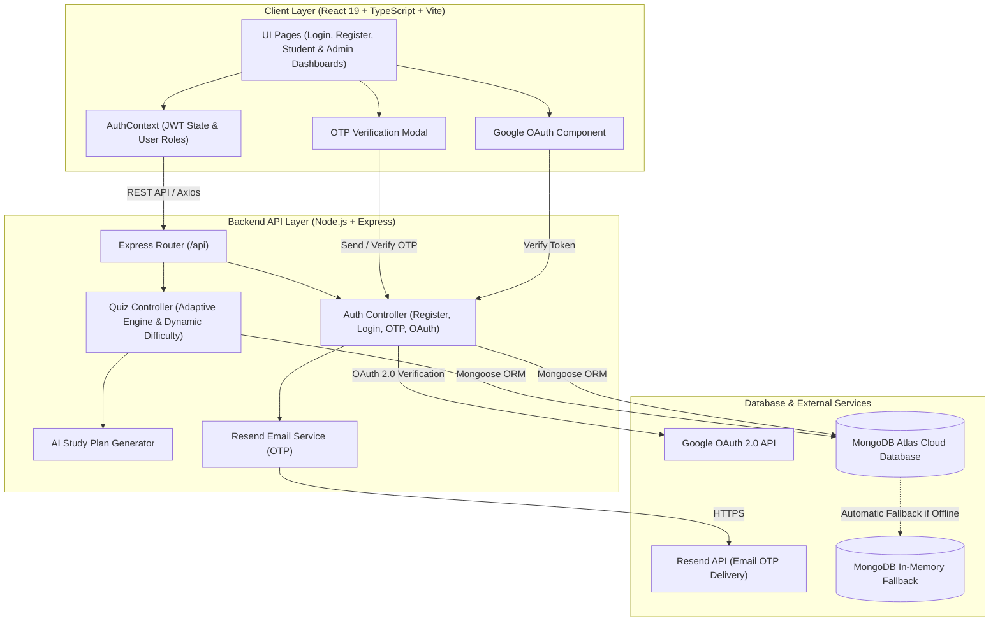

# 🧠 AI Adaptive Quiz Platform

An intelligent, enterprise-grade full-stack assessment platform featuring a dynamic **AI-driven Adaptive Difficulty Evaluation Engine**, **Google OAuth 2.0**, **Email OTP Verification**, **AI Study Plan Generator**, and **Real-Time Performance Analytics**.

Built on the modern MERN stack (MongoDB, Express, React 19, Node.js) with TypeScript and Tailwind CSS v4, this platform evaluates student mastery in real-time—dynamically scaling question difficulty up or down based on individual answer accuracy.

---

## 🌟 Key Features

### 👤 Authentication & Security
- **Email OTP Verification**: Secure 6-digit email OTP delivery powered by **Resend API**, featuring auto-expiration, attempt limits, and disposable email detection (`disposable-email-domains`).
- **Google OAuth 2.0**: Seamless single sign-on (SSO) integration using `@react-oauth/google` and Google API verification.
- **JWT & Role-Based Access Control (RBAC)**: Secure JSON Web Token authentication protecting routes for **Student** and **Admin** user roles with encrypted password storage (`bcryptjs`).

### 🧠 Dynamic AI Adaptive Engine
- **Real-Time Difficulty Adjustment**:
  - Starts each session at **Medium** difficulty.
  - Correct answers elevate difficulty (`Easy` ➔ `Medium` ➔ `Hard`).
  - Incorrect answers lower difficulty (`Hard` ➔ `Medium` ➔ `Easy`).
- **Topic Mastery Tracking**: Evaluates student proficiency across individual subjects and sub-topics.
- **Dynamic Question Selection**: Fetches unvisited questions matching current student difficulty tier in real-time.
- **AI Study Plan Generator**: Analyzes weak areas and generates customized study recommendations and action steps for students.

### 📊 Role-Based Dashboards

#### 🎓 Student Features
- **Adaptive Quiz Engine**: Interactive quiz interface with timer, immediate answer feedback, and adaptive progression.
- **Performance Analytics**: Visual progress graphs, mastery percentages by topic, accuracy rates, and completed quiz history.
- **Personalized AI Study Recommendations**: Tailored learning guidance generated from topic performance metrics.

#### 🛠️ Administrator Features
- **Question Bank CRUD**: Create, edit, search, filter, and delete questions with subject tags, difficulty levels, and rich explanations.
- **Quiz Management**: Create static and adaptive quizzes, set durations, question counts, and passing criteria.
- **Platform Analytics**: Aggregate class performance overview, subject difficulty distributions, and user completion rates.

### ⚡ Resilient Backend Architecture
- **Dual Database Strategy**: Connects to **MongoDB Atlas Cloud** seamlessly, with automatic fallback to an **In-Memory MongoDB Server** (`mongodb-memory-server`) if offline—ensuring zero startup failures during local development.
- **Real-Time Communication**: **Socket.io** integration for real-time quiz updates and live monitoring.

---

## 🛠️ Tech Stack

| Domain | Technology |
|---|---|
| **Frontend Client** | React 19, TypeScript, Vite 8, React Router v7 |
| **Styling & UI** | Tailwind CSS v4, Lucide Icons, Recharts |
| **Backend API** | Node.js, Express.js (v4), Socket.io |
| **Database** | MongoDB Atlas, Mongoose (v8), MongoDB Memory Server |
| **Authentication** | JWT (`jsonwebtoken`), bcryptjs, Resend API (OTP), Google OAuth 2.0 |
| **PDF & Utilities** | PDFKit, pdf-parse, jsPDF, Axios |

---

## 📂 Project Architecture

### 🏗️ System Architecture Diagram



### 📁 Directory Layout

```text
ai-adaptive-quiz-platform/
├── server/                         # Express Backend Server
│   ├── config/                     # Database connection & initial seeder
│   │   ├── db.js                   # Mongoose connection with Memory-Server fallback
│   │   └── seed.js                 # Admin/Student seed script
│   ├── controllers/                # Request handling logic
│   │   └── authController.js       # Register, Login, OTP, Google OAuth logic
│   ├── models/                     # Mongoose Schemas (User, Quiz, Question, Result)
│   ├── routes/                     # API Route definitions
│   │   ├── authRoutes.js           # Auth & OTP endpoints
│   │   ├── questionRoutes.js       # Question Bank CRUD
│   │   └── quizRoutes.js           # Quiz management & adaptive logic
│   ├── services/                   # Business logic (AI study plan generator)
│   ├── utils/                      # Email service (Resend) & validators
│   ├── .env.example                # Backend environment variable template
│   └── server.js                   # Express application entrypoint
│
├── src/                            # React Frontend Application
│   ├── components/                 # Reusable UI components
│   │   ├── GoogleAuthButton.tsx    # Google OAuth 2.0 Login button
│   │   ├── OTPVerificationModal.tsx# OTP input modal with auto-focus & paste
│   │   ├── QuestionCard.tsx        # Question card rendering
│   │   └── Navbar.tsx              # Top navigation bar
│   ├── context/                    # React Context (AuthContext)
│   ├── pages/                      # Page views
│   │   ├── LoginPage.tsx           # Login page
│   │   ├── RegisterPage.tsx        # Registration page
│   │   ├── StudentDashboard.tsx    # Student metrics & quiz view
│   │   ├── AdminDashboard.tsx      # Admin management dashboard
│   │   └── QuizTake.tsx            # Live quiz execution screen
│   ├── App.tsx                     # Main routes & layout
│   └── main.tsx                    # React DOM entrypoint with Google Provider
│
├── .env.example                    # Frontend environment variable template
└── README.md                       # Comprehensive documentation
```

---

## 🚀 Getting Started

### 📋 Prerequisites
- **Node.js** (v18.0.0 or higher recommended)
- **npm** (v9.0.0 or higher)
- **MongoDB** (Optional: Local MongoDB instance or free MongoDB Atlas account. In-memory fallback runs automatically if no database URL is provided).

---

### ⚙️ Installation & Setup

#### 1. Clone the Repository
```bash
git clone https://github.com/Ashish17777/ai-adaptive-quiz-platform.git
cd ai-adaptive-quiz-platform
```

#### 2. Configure Backend Environment
Navigate to the `server/` folder and create a `.env` file from `.env.example`:

```bash
cd server
cp .env.example .env
```

Edit `server/.env` with your configuration:
```env
PORT=5000
MONGODB_URI=mongodb://127.0.0.1:27017/adaptive-quiz
JWT_SECRET=your_super_secret_jwt_key_here

# Email OTP Verification (Resend API)
RESEND_API_KEY=your_resend_api_key
RESEND_FROM_EMAIL=onboarding@resend.dev

# Google OAuth 2.0 Client ID
VITE_GOOGLE_CLIENT_ID=your_google_client_id.apps.googleusercontent.com

# AI LLM Integration (Optional)
GEMINI_API_KEY=your_gemini_api_key
```

#### 3. Install Backend Dependencies & Seed Database
```bash
npm install
npm run seed
```

#### 4. Configure Frontend Environment
Return to the project root and create a `.env` file:

```bash
cd ..
cp .env.example .env
```

Edit root `.env`:
```env
VITE_API_URL=http://localhost:5000/api
VITE_GOOGLE_CLIENT_ID=your_google_client_id.apps.googleusercontent.com
```

#### 5. Install Frontend Dependencies
```bash
npm install
```

---

## 🏃 Running the Application

### Option A: Concurrent Development Mode (Recommended)

1. **Start Backend API Server** (Port `5000`):
   ```bash
   cd server
   npm run dev
   ```

2. **Start Frontend Vite Client** (Port `5173`):
   ```bash
   # In a second terminal at project root
   npm run dev
   ```

Open your browser and navigate to **`http://localhost:5173`**.

---

## 🔑 Pre-Seeded Demo Accounts

You can instantly log in using the demo accounts populated during `npm run seed`:

| Role | Email | Password | Access Rights |
|---|---|---|---|
| 👑 **Administrator** | `admin@quiz.com` | `admin123` | Question Bank CRUD, Quiz Creation, Aggregate Analytics |
| 🎓 **Student** | `student@quiz.com` | `student123` | Adaptive Quizzes, Student Dashboard, Study Plan Generator |

*You can also register new user accounts directly through the UI via Email OTP or Google Sign-In.*

---

## 🔌 API Endpoint Documentation

### 🔑 Authentication (`/api/auth`)
| Method | Endpoint | Description | Access |
|---|---|---|---|
| `POST` | `/api/auth/register` | Register a new user account | Public |
| `POST` | `/api/auth/login` | Authenticate existing user & receive JWT token | Public |
| `POST` | `/api/auth/send-otp` | Generate and email 6-digit OTP code | Public |
| `POST` | `/api/auth/verify-otp` | Verify 6-digit OTP code | Public |
| `POST` | `/api/auth/google` | Authenticate or register via Google OAuth | Public |

### ❓ Question Bank (`/api/questions`)
| Method | Endpoint | Description | Access |
|---|---|---|---|
| `GET` | `/api/questions` | List all question bank entries (with filters) | Admin |
| `POST` | `/api/questions` | Create a new question entry | Admin |
| `PUT` | `/api/questions/:id` | Update an existing question | Admin |
| `DELETE` | `/api/questions/:id` | Remove a question from bank | Admin |

### 📝 Quizzes & Adaptive Engine (`/api/quizzes`)
| Method | Endpoint | Description | Access |
|---|---|---|---|
| `GET` | `/api/quizzes` | Fetch available static and adaptive quizzes | Student / Admin |
| `POST` | `/api/quizzes` | Create a new quiz blueprint | Admin |
| `POST` | `/api/quizzes/adaptive/next` | Evaluate user choice & compute next adaptive question | Student |
| `POST` | `/api/quizzes/submit` | Submit finalized quiz attempt & receive full score breakdown | Student |
| `GET` | `/api/quizzes/study-plan` | Generate personalized AI study recommendations | Student |

---

## 🤝 Contributing

Contributions, issues, and feature requests are welcome!

1. **Fork** the Repository (`https://github.com/Ashish17777/ai-adaptive-quiz-platform`)
2. **Create** your Feature Branch (`git checkout -b feature/amazing-feature`)
3. **Commit** your Changes (`git commit -m 'feat: add amazing feature'`)
4. **Push** to the Branch (`git push origin feature/amazing-feature`)
5. **Open** a Pull Request

---

## 📜 License

Distributed under the **MIT License**. See `LICENSE` for more information.
