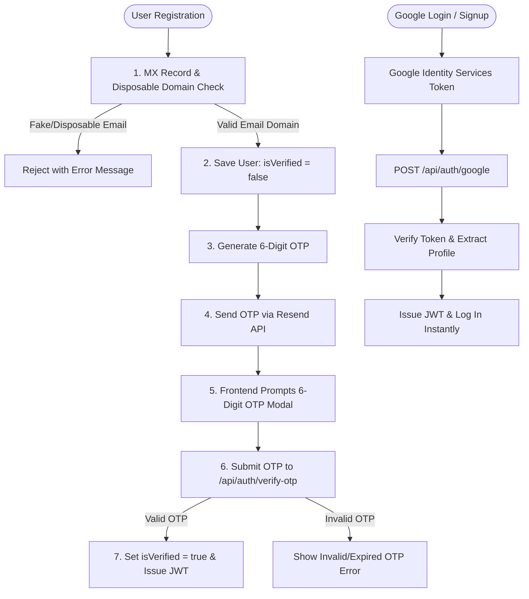

# Task Plan: Resend Email OTP Verification & Google OAuth 2.0 Integration

## Goal
Implement a robust email verification system using Resend API + MX/Disposable email domain filtering, combined with Google OAuth 2.0 authentication for seamless single sign-on.

---

## 🏗️ Architecture & Component Roadmap

---

## 📋 Steps & Execution Tasks

### Phase 1: Dependencies & Environment Setup
- [ ] Install `resend`, `google-auth-library`, `disposable-email-domains` in `server/`
- [ ] Install `@react-oauth/google` in root `package.json`
- [ ] Configure `RESEND_API_KEY`, `RESEND_FROM_EMAIL`, and `VITE_GOOGLE_CLIENT_ID` in `.env` files

### Phase 2: Backend Core Services
- [ ] **`server/utils/emailValidator.js`**: Implement `validateEmailDomain()` checking MX records via Node `dns.resolveMx` and blocking disposable domains.
- [ ] **`server/utils/emailService.js`**: Implement `sendOTPEmail()` using Resend SDK with fallback logging.
- [ ] **`server/models/userModel.js`**: Add `isVerified`, `otpCode`, `otpExpiresAt`, `googleId` fields.
- [ ] **`server/controllers/authController.js`**:
  - Update `register`: Perform MX/disposable check, save unverified user, send OTP.
  - Implement `verifyOTP`: `/api/auth/verify-otp` endpoint to validate OTP code and return JWT.
  - Implement `resendOTP`: `/api/auth/resend-otp` endpoint to issue new OTP.
  - Implement `googleAuth`: `/api/auth/google` endpoint for Google Sign-In verification.
- [ ] **`server/routes/authRoutes.js`**: Expose `/verify-otp`, `/resend-otp`, and `/google` endpoints.

### Phase 3: Frontend Interface & Flow
- [ ] **`src/components/OTPVerificationModal.tsx`**: Build 6-digit OTP input modal with countdown timer & resend link.
- [ ] **`src/pages/RegisterPage.tsx`**: Trigger OTP modal upon registration success.
- [ ] **`src/pages/LoginPage.tsx`**: Add Google Sign-in button & unverified account alert handling.
- [ ] **`src/main.tsx` / `src/App.tsx`**: Wrap with `GoogleOAuthProvider`.

### Phase 4: Verification & Testing
- [ ] Verify fake/disposable email blocking (`@tempmail.com`, non-existent domain).
- [ ] Verify OTP sending via Resend API and successful account activation.
- [ ] Verify Google OAuth login flow.

---

## 🔒 Security Requirements
1. OTP tokens expire in 10 minutes (`otpExpiresAt`).
2. Passwords are never returned in auth responses.
3. Unverified accounts cannot take quizzes or access dashboards until verified.
